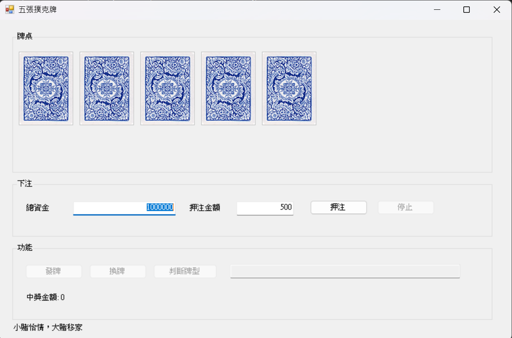
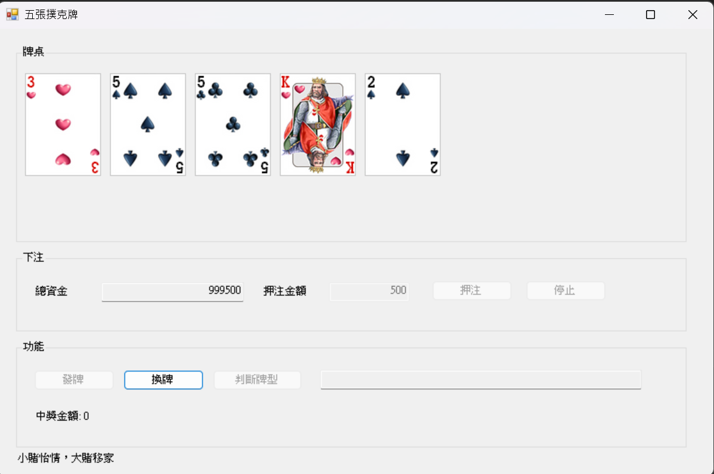
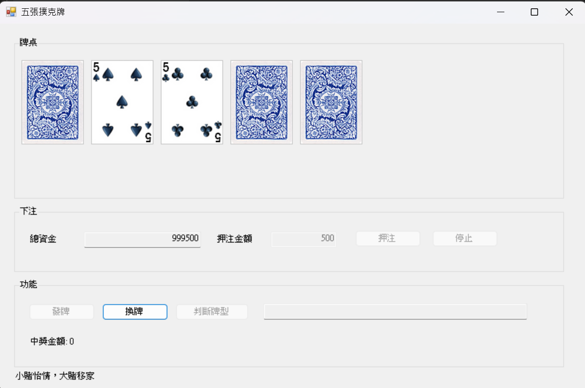
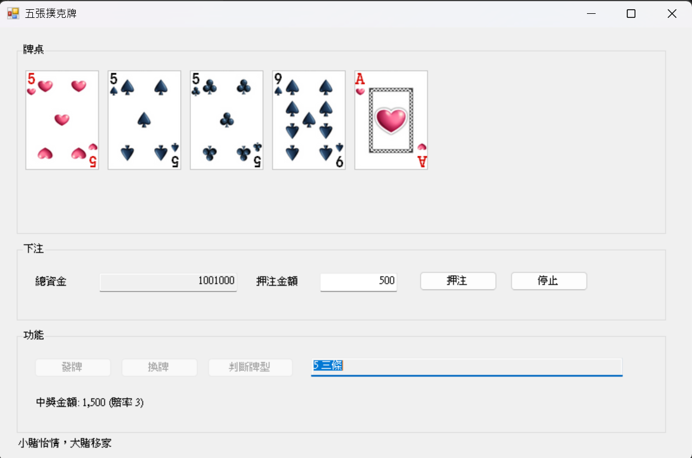

## 專案簡介
本專案為 課堂實作作業：五張撲克牌。

功能包含：
- 五張撲克牌發牌、選牌、換牌與牌型判斷
- 依照牌型賠率計算中獎金額
- 下注功能（可設定初始資金、每局押注、資金不足提示）
- 停止功能（輸出累計輸贏後結束程式）

牌型與賠率：
- 皇家同花順：250
- 同花順：50
- 四條：25
- 葫蘆：9
- 同花：6
- 順子：4
- 三條：3
- 兩對：2
- 一對：1

## 操作流程
1. 第一次押注前可輸入「總資金」。
2. 輸入「押注金額」後按 `押注`。
3. 按 `發牌`，點擊欲換牌的牌（顯示牌背表示已選取）。
4. 按 `換牌`。
5. 按 `判斷牌型`，系統顯示牌型與本局中獎金額。
6. 可繼續下一局，或按 `停止` 顯示累計輸贏並結束程式。

## 範例
1. 程式啟動畫面（含牌桌、下注區、功能區）
   - 
2. 押注後發牌畫面（五張牌翻開）
   - 
3. 選牌換牌畫面
   - 
4. 判斷牌型與中獎金額畫面
   - 

